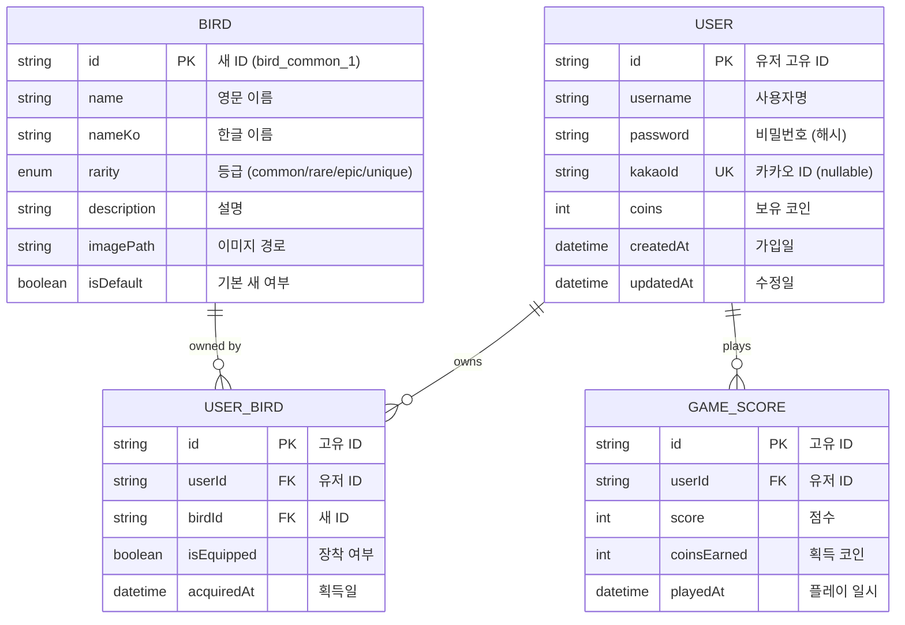

# Project Overview

프로젝트 이름: FLAPPY-BIRD
프로젝트 설명: Flappy Bird 스타일의 캐주얼 **모바일 게임 앱**
플랫폼: iOS / Android

---

## Tech Stack

### Frontend (확정)
- Next.js 16 (App Router, Turbopack)
- React 18
- TypeScript
- Tailwind CSS
- Lucide React (아이콘)
- NextAuth.js (인증)

### Backend
- TBD (Firebase / Supabase / Custom)

### Database
- TBD (Firestore / PostgreSQL)

### 외부 서비스
- Kakao SDK (로그인, 친구 목록)
- 인앱 결제 (App Store / Google Play)

### DevOps / Infrastructure
- TBD

### Other Tools
- V0 (UI 목업)

### MCP (Model Context Protocol)
- **context7** - 최신 라이브러리 문서 참조 (필수)
- **github** - GitHub API 연동

---

## TODO List

### In Progress
- [ ] 실제 구현
  - [x] LoginScreen (사용자 이름/비밀번호, 카카오 ID 연동)
  - [ ] HomeScreen (메인 메뉴)
  - [ ] GameScreen (새 조작, 점수, 파이프 장애물)
  - [ ] BirdSelectionScreen (COMMON, RARE, EPIC, UNIQUE 등급)
  - [ ] RankingScreen (카카오톡 친구 기반)

### Pending
- [ ] 로그인 API 연동
- [ ] 카카오 SDK 연동
- [ ] 새(Bird) 데이터베이스 테이블 생성
  - birds 테이블: 새 정보 (id, name, rarity 등)
  - user_birds 테이블: 사용자별 보유 새 (user_id, bird_id, equipped 등)
- [ ] 코인 시스템 구현
  - 게임 점수 → 코인 변환 (게임 종료 시 점수를 보유 코인에 추가)
  - 유저별 코인 잔액 관리
- [ ] (검토중) 10연차 할인 시스템 (500 → 450코인)

### Completed
- [x] GitHub에 repository 생성 및 추가
- [x] Agent 추가하기 (Code Review, Security 등)
- [x] 브랜치 전략 설정 (main/dev)
- [x] GitHub 템플릿 추가 (PR, Issue)
- [x] V0 목업 검토 및 기술 스택 결정 (Next.js)
- [x] 프로젝트 구조 설계
- [x] UI 컴포넌트 모듈화 (FlappyBird, SeasonalBackground)
- [x] 계절 테마 시스템 구현 (봄/여름/가을/겨울)

---

## Agent Types

프로젝트에서 사용하는 AI Agent 유형을 정의합니다.

| Agent Name | Role | Description |
|------------|------|-------------|
| code-review | 코드 리뷰 | PR 전 코드 품질 자동 체크 |
| security-guidance | 보안 가이드 | 보안 취약점 사전 방지 |
| pr-review-toolkit | PR 리뷰 | 이슈 연결 및 PR 리뷰 자동화 |

---

## Screens (앱 화면 구성)

| 화면 | Screen Name | 설명 |
|------|-------------|------|
| 로그인 | `LoginScreen` | 로그인/회원가입 화면 |
| 홈 | `HomeScreen` | 메인 메뉴 (로그인 후) |
| 인게임 | `GameScreen` | 메인 게임 플레이 화면 |
| 새 선택 | `BirdSelectionScreen` | 캐릭터 선택 및 구매 화면 |
| 랭킹 | `RankingScreen` | 친구 랭킹 조회 화면 |

### 화면 흐름 (Navigation Flow)
```
LoginScreen
    ↓ (로그인 성공)
HomeScreen ←→ BirdSelectionScreen
    ↓              ↓
GameScreen    RankingScreen
    ↓
GameOverModal → HomeScreen
```

---

## KEY FEATURES

프로젝트의 핵심 기능 및 특징을 설명합니다.

### Feature 1: 로그인 시스템
- 설명: 사용자 이름/비밀번호 기반 로그인 + 카카오 ID 연동
- 관련 파일: `components/login-page.tsx`, `lib/auth.ts`
- 세부 기능:
  - 일반 로그인 (이름 + 비밀번호) ✅
  - 카카오 소셜 로그인 (UI 완료, API 연동 예정)
  - 자동 로그인 (토큰 저장) - 예정
- 구현 상태: UI 완료, API 연동 대기

### Feature 2: 인게임 플레이
- 설명: Flappy Bird 스타일의 메인 게임 플레이
- 관련 파일: TBD
- 세부 기능:
  - 새(캐릭터) 조작 (탭/클릭으로 점프)
  - 파이프 장애물 생성 및 충돌 감지
  - 실시간 점수 표시
  - 게임 오버 처리

### Feature 3: 새(캐릭터) 뽑기 시스템
- 설명: 코인으로 랜덤 뽑기를 통해 새 캐릭터 획득
- 관련 파일: `types/bird.ts`, `lib/birds.ts`
- **뽑기 시스템 (가챠)**:
  - 1회 뽑기 비용: **50코인**
  - 중복 시 환급: **25코인** (50%)
  - 등급별 확률:
    | 등급 | 확률 |
    |------|------|
    | COMMON | 70% |
    | RARE | 20% |
    | EPIC | 7% |
    | UNIQUE | 3% |
- **등급별 UI 색상** (카드 테두리, 배지, 이펙트 등):
  | 등급 | 색상 | HEX |
  |------|------|-----|
  | COMMON | Gray | #6B7280 |
  | RARE | Blue | #3B82F6 |
  | EPIC | Purple | #8B5CF6 |
  | UNIQUE | Gold | #F59E0B |
- ID 규칙: `bird_{rarity}_{number}` (예: bird_common_1)
- 현재 등록된 새:
  - COMMON: 10마리 (bird_common_1은 기본 보유)
  - EPIC: 9마리
- **이미지 처리**:
  - `bird_common_1`: FlappyBird SVG 컴포넌트 (`imagePath: "svg"`)
  - 그 외 모든 새: 개별 PNG 파일 (`bird_{rarity}_{number}.png`)
  - **이미지 규격** (모든 등급 공통):
    | 항목 | 값 |
    |------|-----|
    | 캔버스 크기 | **160x110px** |
    | 배경 | **투명 (PNG alpha)** |
    | 새 정렬 | **가운데 정렬** |
    | 새 크기/여백 | `bird_common_2.png` 기준 |
  - **이미지 업로드 시 처리 순서**:
    1. 배경이 투명한지 검증 (불투명 시 사용자에게 확인)
    2. 새의 바운딩 박스 추출
    3. `bird_common_2.png` 기준 크기로 스케일 (비율 유지)
    4. 160x110 투명 캔버스에 가운데 배치
- 이미지 경로: `images/birds/{rarity}/`
- 구현 상태: 타입/로직 완료, UI 구현 예정

### Feature 4: 랭킹 시스템
- 설명: 카카오톡 친구 기반 순위 시스템
- 관련 파일: TBD
- 세부 기능:
  - 카카오 친구 목록 연동
  - 친구들 간 점수 비교
  - 주간/전체 랭킹

### Feature 5: 계절 테마 시스템
- 설명: 사용자가 선택 가능한 계절별 배경 테마
- 관련 파일: `components/ui/SeasonalBackground.tsx`, `components/ui/SeasonSelector.tsx`
- 테마 종류:
  | 계절 | 하늘 | 잔디 | 장식 |
  |------|------|------|------|
  | 봄 | 연한 하늘빛 | 연두색 | 벚꽃잎 |
  | 여름 | 청량한 파랑 | 진초록 | - |
  | 가을 | 노을빛 | 갈색 | 낙엽 |
  | 겨울 | 연한 회색빛 | 흰색(눈) | 눈송이 |
- 구현 상태: 완료

### 디자인 컨셉
- **자연 친화적 분위기**: 숲, 하늘, 자연 배경 + 계절 테마
- **현대적 UI**: 깔끔하고 세련된 인터페이스
- **강렬한 장애물**: 기존보다 임팩트 있는 파이프 디자인

---

## Project Structure

```
FLAPPY-BIRD/
├── .github/                    # GitHub 템플릿
│   ├── PULL_REQUEST_TEMPLATE.md
│   └── ISSUE_TEMPLATE/
│
├── app/                        # Next.js App Router (라우팅)
│   ├── api/                    # API 라우트 (Backend)
│   │   └── auth/               # 인증 API (NextAuth)
│   ├── globals.css             # 전역 스타일
│   ├── layout.tsx              # 루트 레이아웃
│   ├── page.tsx                # 메인 페이지
│   └── providers.tsx           # Context Providers
│
├── components/                 # UI 컴포넌트 (Frontend)
│   ├── ui/                     # 공통 UI 컴포넌트
│   │   ├── FlappyBird.tsx      # 새 아이콘 SVG
│   │   ├── SeasonalBackground.tsx # 계절 배경 테마
│   │   ├── SeasonSelector.tsx  # 배경 선택 드롭다운
│   │   └── index.ts            # 컴포넌트 Export
│   ├── login-page.tsx          # 로그인 페이지
│   ├── game-page.tsx           # 게임 페이지 (예정)
│   ├── bird-selection-page.tsx # 새 선택 (예정)
│   └── ranking-page.tsx        # 랭킹 페이지 (예정)
│
├── lib/                        # 비즈니스 로직 (Backend)
│   ├── auth.ts                 # NextAuth 설정
│   └── birds.ts                # 새 데이터 및 매핑
│
├── types/                      # TypeScript 타입 정의
│   ├── next-auth.d.ts          # NextAuth 타입 확장
│   └── bird.ts                 # 새 관련 타입 정의
│
├── images/                     # 이미지 리소스
│   └── birds/                  # 새 이미지
│       ├── common/             # COMMON 등급
│       ├── rare/               # RARE 등급
│       ├── epic/               # EPIC 등급
│       └── unique/             # UNIQUE 등급
├── package.json
├── tailwind.config.ts
├── tsconfig.json
├── .env.local                  # 환경 변수 (Git 제외)
├── .gitignore
└── CLAUDE.md                   # 프로젝트 문서
```

### 폴더 역할
| 폴더 | 역할 | 구분 |
|------|------|------|
| `app/` | 라우팅, 페이지, API | Router |
| `app/api/` | REST API 엔드포인트 | Backend |
| `components/` | UI 컴포넌트 | Frontend |
| `lib/` | 비즈니스 로직, 설정 | Backend |
| `types/` | 타입 정의 | Shared |

---

## ER Diagram



### 엔터티 설명

| 엔터티 | 설명 |
|--------|------|
| `USER` | 사용자 정보 (로그인, 코인 잔액) |
| `BIRD` | 새(캐릭터) 마스터 데이터 |
| `USER_BIRD` | 사용자별 보유 새 (N:M 관계) |
| `GAME_SCORE` | 게임 기록 (랭킹용) |

### 관계

- **USER ↔ BIRD**: 다대다 (USER_BIRD 중간 테이블)
- **USER → GAME_SCORE**: 일대다 (한 유저가 여러 게임 기록)

---

## Commands

```bash
# 설치
npm install

# 개발 서버 실행
npm run dev

# 테스트
npm run lint

# 빌드
npm run build

# 프로덕션 실행
npm run start
```

---

## Workflow

### Branch Strategy

```
main (production)
 └── dev (development)
      ├── feature/login
      ├── feature/game
      ├── feature/bird-selection
      └── feature/ranking
```

| Branch | Purpose |
|--------|---------|
| `main` | 배포 가능한 안정 버전 |
| `dev` | 개발 통합 브랜치 |
| `feature/*` | 기능별 작업 브랜치 |

### 작업 흐름
1. `dev`에서 `feature/*` 브랜치 생성
2. 작업 완료 → `dev`로 PR 생성 및 Merge
3. `dev`에서 충분히 테스트
4. 안정화되면 `main`으로 Merge

### PR 생성 시
- PR 생성 전 관련 이슈 확인 필수
- 이슈와 연결하여 PR 생성
- PR 템플릿 양식에 맞게 작성

---

## Notes

추가 참고 사항이나 주의점을 기록합니다.

### 개발 규칙
- 작업 완료 시 CLAUDE.md 업데이트 필요 여부 검토할 것
- 기능 개발 전 관련 이슈 생성 필수
- PR은 반드시 `dev` 브랜치로 먼저 머지

### Context7 MCP 필수 사용 (중요!)
**모든 개발 작업 시 Context7 MCP를 사용하여 최신 문서를 참조할 것**

사용 방법:
- 프롬프트에 `use context7` 키워드 포함
- 라이브러리/프레임워크 관련 코드 작성 시 반드시 최신 문서 확인

예시:
```
"use context7로 Next.js App Router 라우팅 구현해줘"
"use context7로 Tailwind CSS 최신 문법 확인해줘"
"use context7로 React 18 hooks 사용법 알려줘"
```

참조 필수 항목:
- Next.js (App Router, Server Components)
- React 18 (Hooks, Suspense)
- Tailwind CSS
- TypeScript
- Kakao SDK (로그인 연동 시)

### 외부 연동
- 카카오 개발자 계정 필요 (로그인 + 친구 목록 API)
- 카카오 앱 등록 필요

### 모바일 앱 고려 사항
- **터치 인터페이스**: 탭으로 새 점프 조작
- **오프라인 플레이**: 지원 여부 결정 필요
- **인앱 결제**: App Store / Google Play 결제 시스템
- **앱 스토어 배포**: iOS (App Store), Android (Google Play)
- **푸시 알림**: 친구 점수 갱신 알림 (선택)

### 앱 권한 (Permissions)
- 인터넷 접근
- 카카오 계정 연동
- (선택) 푸시 알림
