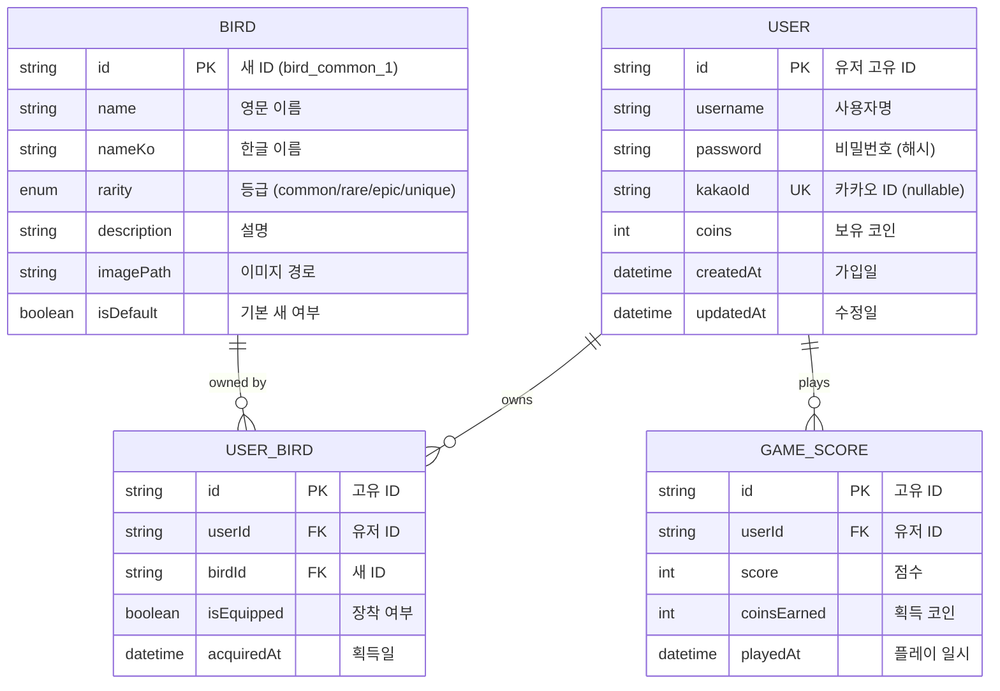

# ER Diagram

프로젝트의 데이터베이스 엔터티 관계도입니다.

## Diagram

## 엔터티 설명

| 엔터티 | 설명 |
|--------|------|
| `USER` | 사용자 정보 (로그인, 코인 잔액) |
| `BIRD` | 새(캐릭터) 마스터 데이터 |
| `USER_BIRD` | 사용자별 보유 새 (N:M 관계) |
| `GAME_SCORE` | 게임 기록 (랭킹용) |

## 관계

- **USER ↔ BIRD**: 다대다 (USER_BIRD 중간 테이블)
- **USER → GAME_SCORE**: 일대다 (한 유저가 여러 게임 기록)

## 필드 상세

### USER
| 필드 | 타입 | 설명 |
|------|------|------|
| id | string | PK, UUID |
| username | string | 사용자명 (unique) |
| password | string | 비밀번호 (bcrypt 해시) |
| kakaoId | string | 카카오 로그인 ID (nullable) |
| coins | int | 보유 코인 (기본값: 0) |
| createdAt | datetime | 가입일 |
| updatedAt | datetime | 최종 수정일 |

### BIRD
| 필드 | 타입 | 설명 |
|------|------|------|
| id | string | PK (bird_{rarity}_{number}) |
| name | string | 영문 이름 |
| nameKo | string | 한글 이름 |
| rarity | enum | common, rare, epic, unique |
| description | string | 설명 |
| imagePath | string | 이미지 경로 또는 "svg" |
| isDefault | boolean | 기본 제공 새 여부 |

### USER_BIRD
| 필드 | 타입 | 설명 |
|------|------|------|
| id | string | PK, UUID |
| userId | string | FK → USER.id |
| birdId | string | FK → BIRD.id |
| isEquipped | boolean | 현재 장착 여부 |
| acquiredAt | datetime | 획득 일시 |

### GAME_SCORE
| 필드 | 타입 | 설명 |
|------|------|------|
| id | string | PK, UUID |
| userId | string | FK → USER.id |
| score | int | 게임 점수 |
| coinsEarned | int | 획득한 코인 |
| playedAt | datetime | 플레이 일시 |
